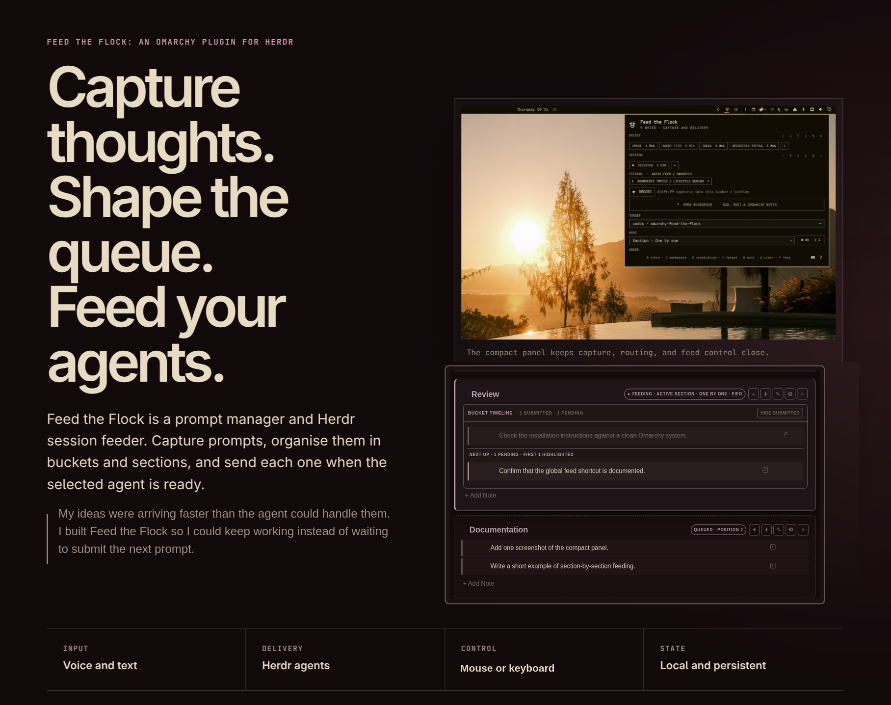

# Feed the Flock



Feed the Flock is an Omarchy plugin for collecting prompts and sending them to Herdr agents when they are ready. Notes stay in a persistent queue, separate from the agent session you are viewing.

## Install

```sh
omarchy plugin add https://github.com/pjgeutjens/omarchy-feed-the-flock.git --enable
```

Feed the Flock uses commands included with a current Omarchy Quattro installation. It can turn a capture from Omarchy's optional Dictation app (Voxtype) into a note; Dictation itself is separate. Typed notes and delivery work without it.

Start Herdr, open Feed the Flock, and choose an agent under **Target**.

## Use it

1. Select or create a bucket and section.
2. Record a thought, or open the workspace and add a typed note.
3. Choose a Herdr target and delivery mode.
4. Add a section to the waiting queue, start the feed, or send an urgent item with **Feed now**.

The feed waits until the selected agent is idle. **One by one** sends one note per idle turn; **Batch** combines the selected scope into one prompt. Section modes stay within the current section. All modes continue through section order. FIFO sends the oldest pending note first, while LIFO sends the newest.

The current destination and waiting sections are global. Browsing another bucket does not change or hide the feed queue. If Feed the Flock restarts while a feed is active, a ten-second notification names the destination that will resume and lets you cancel it.

## Panel controls

The panel handles capture, routing, queue state, and feed control. Its main shortcuts are:

| Key | Action |
| --- | --- |
| `R` | Start or finish a Voxtype capture |
| `T` | Choose a Herdr target |
| `M` | Choose a delivery mode |
| `Q` | Choose FIFO or LIFO |
| `F` | Start or stop the feed |
| `O` | Open the workspace |
| `B` / `Shift+B` | Create or rename a bucket |
| `S` / `Shift+S` | Create or rename a section |
| `G` / `Shift+G` | Queue a section or feed it now |
| `N` | Show pending notes |
| `K` | Configure optional global shortcuts |
| `?` | Show all shortcuts |

The target picker accepts typed filtering. Press `↓` to enter its result list, use `J/K` or the arrow keys to move, then press `Enter`.

Global capture and feed shortcuts are optional. Feed the Flock checks for conflicts when you save one and asks before overriding an existing action.

## Workspace

The workspace is a local document view for editing and ordering notes. Drag note or section handles with the mouse, or use the keyboard:

| Key | Action |
| --- | --- |
| `J/K` | Select the previous or next note |
| `H/L` | Select the previous or next section |
| `U/D` | Move the selected note or section |
| `A` | Add a note to the selected section |
| `o/O` | Add a note after or before the selected note |
| `P` | Add an image to the selected note |
| `F` | Feed the selected note or section now |
| `Q` | Add the selected section to the waiting queue |
| `T` | Open delivery routing |
| `/` | Search headings and notes |
| `?` | Show all workspace shortcuts |

Press `Enter` to edit a selected note. While editing, `Enter` saves, `Shift+Enter` inserts a newline, and `Esc` cancels. Left-click copies a note and right-click edits it. Section dragging scrolls the page when the pointer reaches a viewport edge.

### Custom workspace files

Keep custom viewer files outside the git-managed plugin directory so updates cannot overwrite them:

```sh
mkdir -p ~/.config/feed-the-flock
cp -a ~/.config/omarchy/plugins/io.github.pjgeutjens.feed-the-flock/workspace \
  ~/.config/feed-the-flock/
```

When `~/.config/feed-the-flock/workspace/index.html` exists, Feed the Flock loads that workspace instead of the built-in one. Rename or remove the custom `workspace` directory to return to the built-in viewer. Compare the custom files with the current built-in workspace when you want to adopt upstream changes.

## Markdown and images

Import and export use this Markdown structure:

```md
# Bucket

## Section

- [ ] Pending note
- [x] Submitted note
```

Plain list items import as pending. Indented lines remain part of the same note. Exported Markdown does not embed attachments.

Pending notes accept up to five PNG, JPEG, WebP, or GIF images of 8 MB each. Add them with `P`, drop them onto a note, or paste an image while editing. Feed the Flock sends images through the Wayland clipboard before the note text and restores the previous clipboard content afterward.

## Data and removal

Notes, delivery history, recordings, logs, and managed images stay under `~/.local/state/feed-the-flock`. The workspace listens only on `127.0.0.1`. Note text and attachments leave the app only when they are sent to the chosen Herdr agent, which may have its own network and tool access.

Before removing the plugin, stop its background processes and restore its managed keybindings:

```sh
~/.config/omarchy/plugins/io.github.pjgeutjens.feed-the-flock/scripts/prepare-remove.sh
omarchy plugin remove io.github.pjgeutjens.feed-the-flock
```

Removal keeps `~/.local/state/feed-the-flock` so an accidental uninstall does not erase notes. Delete that directory yourself if you also want to remove the stored data.

Update with:

```sh
omarchy plugin update io.github.pjgeutjens.feed-the-flock
```

Feed the Flock is licensed under the [MIT License](LICENSE).
